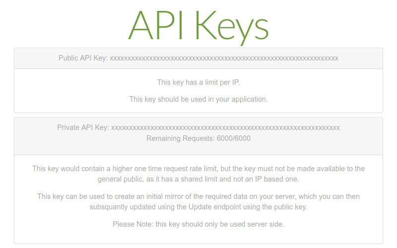

# Day 9 - thegamesdb Gem - Get Donkey Kong, Super Mario Bros., The Legend of Zelda 'n' More. API Client for TheGamesDB, an Open Database for Video Game Data


Written by  [Fernando Briano](https://github.com/picandocodigo)

_Software engineer at [Elastic](https://www.elastic.co) maintaing among others many elastic gems and member of [Data Uruguay](https://data.org.uy/) - an open data, transparency and information access non-governmental org (NGO) - has worked on open data projects. Blogs at [Picando Código](https://picandocodigo.net). Plays Nintendo. Listens to Punk Rock. Reads books. Drinks beer._


[TheGamesDb](https://thegamesdb.net/) is an open, online database with information about video games. You can find information about video game consoles, developers, publishers and obviously game titles! The data is backed up by a community of users and you can join and submit data yourself.

The website has a [JSON HTTP API](https://api.thegamesdb.net/) which you can use in your own application to retrieve data from the database. A few years ago I started a Rails project which was going to use data from TheGamesDB. I assumed there'd already be a gem for this, so I went looking for it. I found a gem which hadn't been updated for a long while so I built my own. The gem is [thegamesdb](https://rubygems.org/gems/thegamesdb) and I recently released version 2.0.0.

I started by implementing just some of the API endpoints, the ones I wanted to use in my Rails app. But in time it kept evolving and I kept updating it and publishing new releases. At some point the original API was deprecated and when it was announced it'd be shut down, I took the opportunity to released version 1.0.0. This first "stable" release added support for the new API which - among other changes - required an API key.

With version `2.0.0`, I implemented 100% of the API endpoints in Ruby, refactored the way the gem works to make it easier to instantiate a client and set the API key, and made some other breaking changes in methods from the `1.x` branch.

You can `gem install thegamesdb` or add `thegamesdb` to your Gemfile to install it. You will need to request an API Key [on the website's forum](https://forums.thegamesdb.net/viewforum.php?f=10).

[](https://api.thegamesdb.net/key.php)

Once you have an API key, you can instantiate a Client:

```ruby
client = Gamesdb::Client.new('<API_KEY>')
response = client.platforms
```

The base API Response includes `remaining_monthly_allowance` for your API key, `extra_allowance` and `allowance_refresh_timer`. These values are updated on the client instance on every request so you can use `client.remaining_monthly_client` to check how many requests the API key has left.

There are five main 'namespaces' for API endpoints: `Games`, `Platforms`, `Genres`, `Developers` and `Publishers`. Genres, Developers and Publishers are very simple methods with no parameters that return an Array of Hashes with information about the respective entities, e.g.:

```ruby
client.genres
#=> [
#  {"id"=>1,  "name"=>"Action"},
#  {"id"=>2,  "name"=>"Adventure"},
#  {"id"=>20, "name"=>"Board"},
#   ...
```

For `Platforms` and `Games` there are several methods for retrieving information: by id, by name, images (filtering with 'boxart', 'banner' or 'fanart') and more. You can find out more about the endpoints in the [README](https://github.com/picandocodigo/gamesdb#gamesdb--).

Hope you check out [`thegamesdb`](https://github.com/picandocodigo/gamesdb) for your video game related projects!


## Find Out More

### References

- home :: [github.com/picandocodigo/gamesdb](https://github.com/picandocodigo/gamesdb)
- gem :: [rubygems.org/gems/thegamesdb](https://rubygems.org/gems/thegamesdb)
