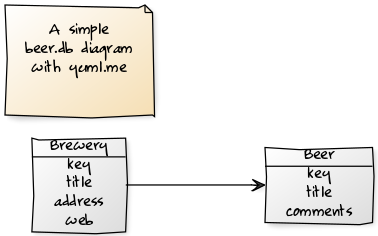

# Week 8 - erd gem - generate entity-relationship diagrams (ERD) for your activerecord models

Let's say you have defined your database schema (tables) with ActiveRecord in Ruby.
Example:

~~~
create_table :breweries do |t|
  t.string  :key,    null: false
  t.string  :title,  null: false
  t.string  :address
  t.string  :web
end

create_table :beers do |t|
  t.references :brewery
  t.string  :key,     null: false
  t.string  :title,   null: false
  t.text    :comments
end
~~~

And your models with classes in Ruby and assocations with class macros such as
`belongs_to`, `has_many`, and so on:

~~~
class Beer < ActiveRecord::Base
  belongs_to :brewery
end

class Brewery < ActiveRecord::Base
  has_many   :beers
end
~~~

How can you auto-generate an entity-relationship diagram?  For example:

The good news. The ActiveRecord machinery already has everything built-in
for a minimal (quick 'n' dirty) do-it-yourself version.

**Step 1: "Discover" all models**

Use `ActiveRecord::Base.descendants` that
gets you an array with all loaded (known) models at runtime
to find (discover) all models of your app. Example:

~~~
models = ActiveRecord::Base.descendants

puts " #{model.size} models:"

models.each do |model|
  puts "  #{model.name}"
end
~~~

Will print for our simple example schema:

~~~
 2 models:
     Beer
     Brewery
~~~

**Step 2: Get all "meta" info - all column definitions and associations**

Now lets print out all columns with its name and SQL type
plus all associations (defined with the "classic" `belongs_to`, `has_many`, etc. macros):

~~~
models.each do |model|
  puts "#{model.name}"
  puts '  columns:'
  model.columns.each do |column|
    puts "    #{column.name} #{column.sql_type}"
  end

  puts '  assocs:'
  model.reflect_on_all_associations.each do |assoc|
    puts "    #{assoc.macro} #{assoc.name}"
  end
end
~~~

Results in:

~~~
Beer
  columns:
    id         integer
    brewery_id integer
    key        varchar(255)
    title      varchar(255)
    comments   text
  assocs:
    belongs_to brewery
Brewery
  columns:
    id         integer
    key        varchar(255)
    title      varchar(255)
    address    varchar(255)
    web        varchar(255)
  assocs:
    has_many beers
~~~

**Step 3: Turn the text describing your models and assocations into a diagram**

Now all that's left is turning the text into a diagram. Again the good news - tools and services
abound - let's start with the `yuml.me` service. Use:

~~~
[note: A simple beer.db diagram with yuml.me  {bg:wheat}]

[Brewery|key;title;address;web] -> [Beer|key;title;comments]
~~~

that gets turned into:

Now why not find a gem that alreay has all the code packed up for easy (re)use
with more examples and a getting started guide and much more?

## What's the `rails-erd` gem?

Let's thank Rolf Timmermans, Kerri Miller, and friends who have created the `rails-erd` gem that
lets you easily auto-generate
entity-relationship diagrams (ERD) from your ActiveRecord models.

Not just for Rails. Although the gem includes rails in its name
it works great with "plain vanilla" ActiveRecord models without
requiring the Rails machinery.
Let's try it using the beer.db ActiveRecord models and schema
bundled-up for easy (re)use in the `beerdb-models` gem.

~~~
require 'beerdb/models'            # use $ gem install beerdb

## Let's create an in-memory SQLite database

DB_CONFIG = {
  adapter: 'sqlite3',
  database: ':memory:'
}

ActiveRecord::Base.establish_connection( DB_CONFIG )

BeerDb.create_all   ## create tables (e.g. breweries, beers, etc.)

## Now hand over to rails-erd

require 'rails_erd/diagram'

class YumlDiagram < RailsERD::Diagram

  setup do
    @edges = []
  end

  each_relationship do |relationship|
    line = if relationship.indirect? then "-.-" else "-" end

    arrow = case
    when relationship.one_to_one?   then "1#{line}1>"
    when relationship.one_to_many?  then "1#{line}*>"
    when relationship.many_to_many? then "*#{line}*>"
    end

    @edges << "[#{relationship.source}] #{arrow} [#{relationship.destination}]"
  end

  save do
    puts @edges.join("\n")
  end
end

YumlDiagram.create
~~~

will result in (simplified):

~~~
[Country] 1-*> [State]
[State] 1-*> [City]
[City] 1-*> [Brewery]
[Brewery] 1-*> [Beer]
[Brewery] 1-*> [Brand]
[Brand] 1-*> [Beer]
~~~

And turned into a diagram:

Note: Instead of using the all-in-one `YumlDiagram.create` convenience method
you can walk through step-by-step. Example:

~~~
## Get all meta-info

domain  = RailsERD::Domain.generate

pp domain.entities        ## dump all entities (models)
pp domain.relationships   ## dump all relationships (assocs)

## Generate diagram

diagram = YumlDiagram.new( domain )

diagram.generate   ## step 1 - generate
diagram.save       ## step 2 - save
~~~

## What's Graphviz and the DOT language?

Note, by default the `rails-erd` uses the `Graphviz` class
to build your diagrams using the graphviz machinery (and its DOT language).

Graphviz (short for Graph Visualization Software) is a free open source
package by AT&T Labs Research
for drawing graphs specified in DOT language scripts
started more than fifteen years ago. Example:

~~~
digraph example
{
  Brewery [shape=box, style=filled, color=blue]
  Beer [shape=box, color=navy]

  Country -> State -> City -> Brewery
  Brewery -> Beer
  Brewery -> Brand
  Brand   -> Beer
}
~~~

Change the `YumlDiagram.create` method to `RailsERD::Diagram::Graphviz.create`
and you will get a GraphViz-generated diagram as a PDF document, PNG pixel graphic,
SVG vector graphic or whatever filetype you desire. That's it.

## Find Out More

* home     :: [github.com/voormedia/rails-erd](https://github.com/voormedia/rails-erd)
* gem      :: [rubygems.org/gems/rails-erd](https://rubygems.org/gems/rails-erd)
* rdoc     :: [rubydoc.info/gems/rails-erd](http://rubydoc.info/gems/rails-erd)
* yuml     :: [yuml.me](http://yuml.me)
* graphviz :: [graphviz.org](http://graphviz.org)
